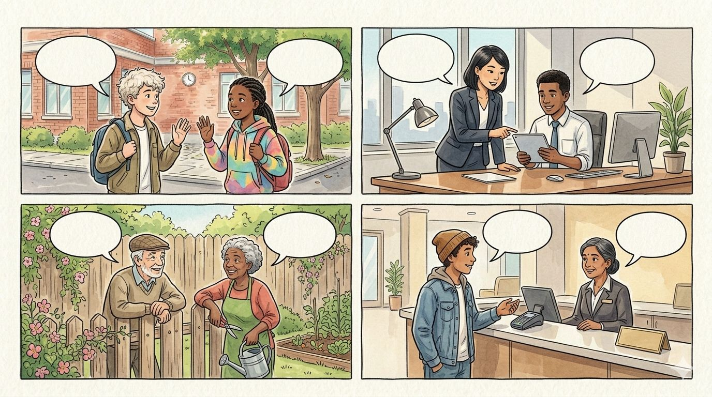
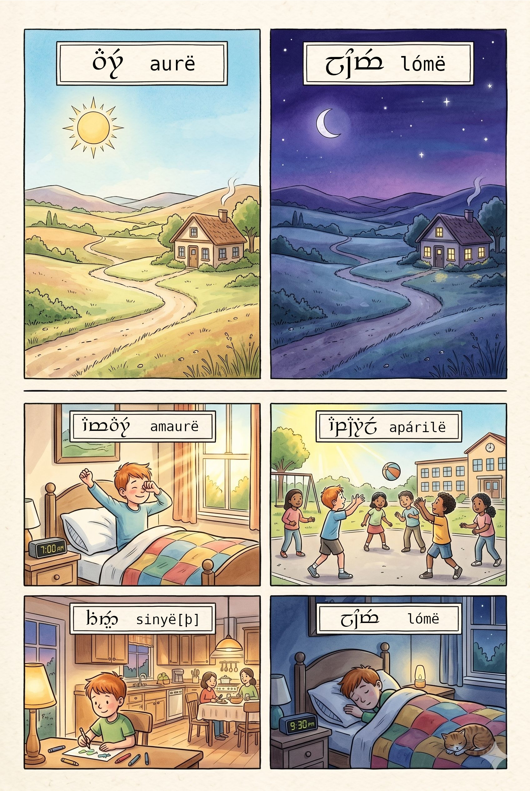

<!--
SPDX-FileCopyrightText: 2026 Bruno Pacheco (https://bruno.pacheco.lu|brunopacheco1@yahoo.com)

SPDX-License-Identifier: CC-BY-4.0
-->
# Carincë {#sec-carince-1}

## Aiya!... ar Namárië!

{#fig-greetings}

- **Alla** - Hi, behold (informal)
- **mesta*** - bye (informal)
- **Aiya** - Hi! Behold! (formal)
- **Namárië!** - Farewell (formal)

## Lúmë

{#fig-daytime}

- **Mára aurë** - Good day
- **Mára amaurë** - Good morning
- **Mára endaurë** - Good midday / noon
- **Mára aparilë** - Good afternoon
- **Mára sinyë[þ]** - Good evening
- **Mára lómë** - Good night
