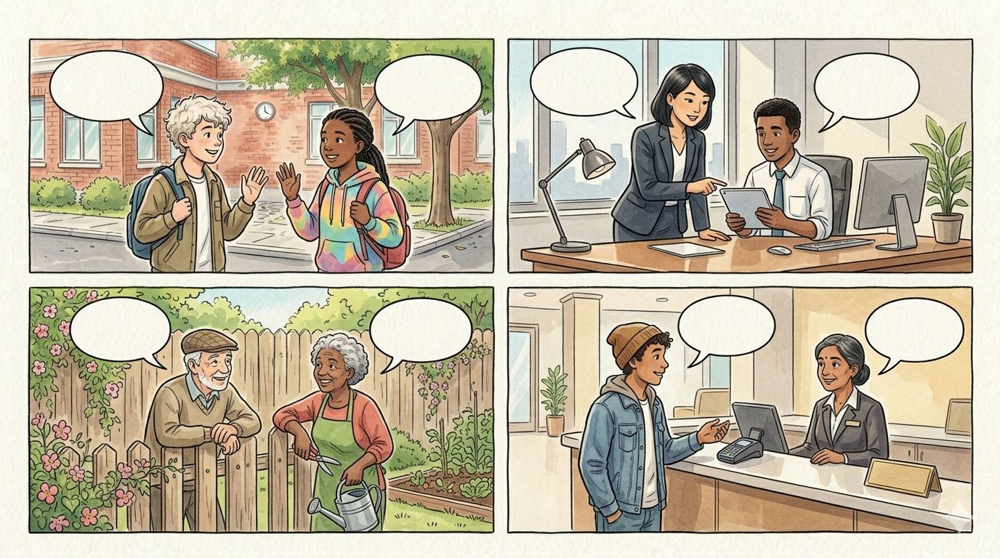
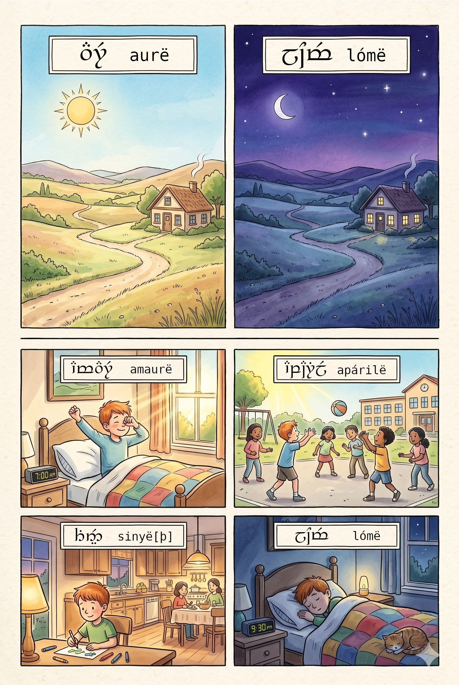
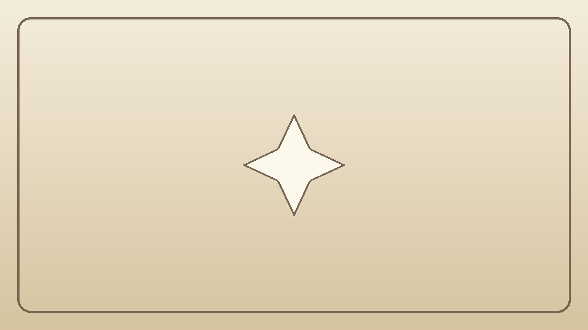
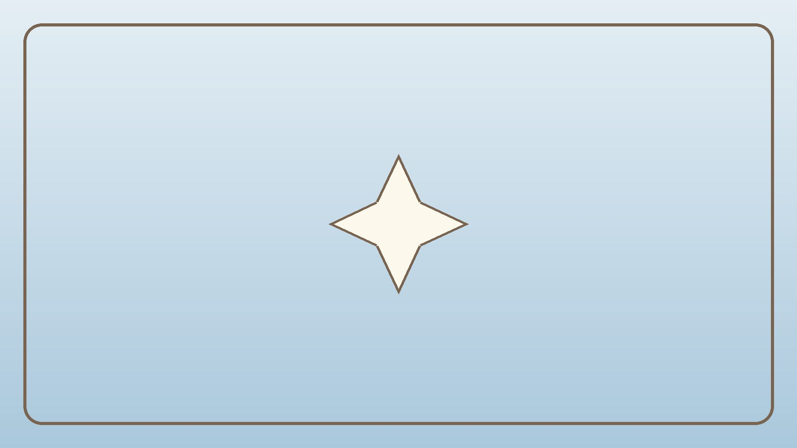
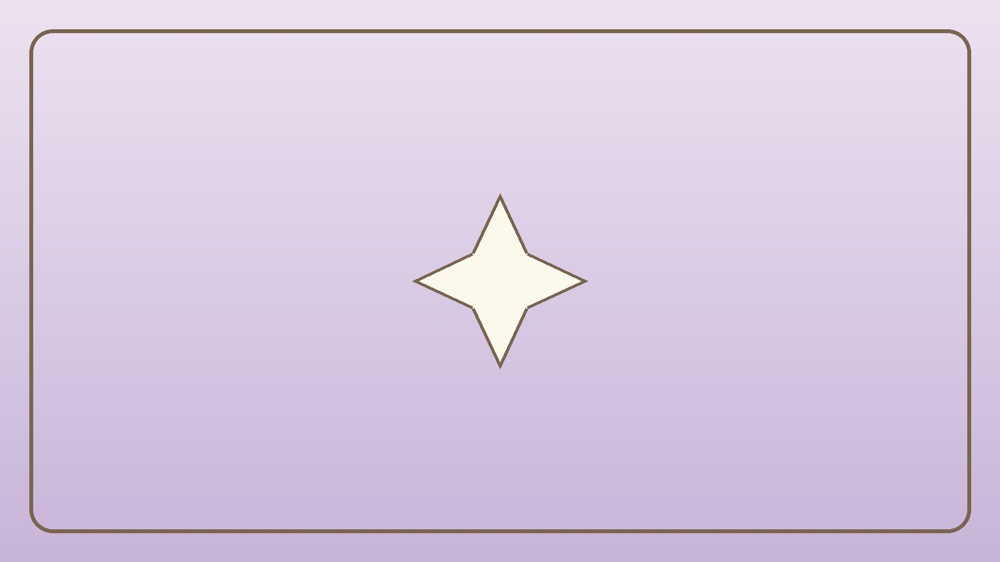

<!--
SPDX-FileCopyrightText: 2026 Bruno Pacheco (https://bruno.pacheco.lu|brunopacheco1@yahoo.com)

SPDX-License-Identifier: CC-BY-4.0
-->
# Carincë {#sec-carince-1}

## Aiya!... ar Namárië!

{#fig-greetings}

:::: {.lasta}
**Á lasta!** 1.1

::: {.content-visible when-format="html" unless-format="epub"}
<audio controls preload="none" src="../audio/carince_1/1-1.mp3"></audio>
:::

::::

- **Alla!** … **Mesta!**
- **Aiya!** … **Namárië!**

### Elenwë ar Nerdanel {.unnumbered}

:::: {.lasta}
**Á lasta!** 1.2

::: {.content-visible when-format="html" unless-format="epub"}
<audio controls preload="none" src="../audio/carince_1/1-2.mp3"></audio>
:::

::::

**Elenwë:** Alla, Nerdanel!\
**Nerdanel:** Alla, Elenwë! Manen nalyë?\
**Elenwë:** Mára, hantanyel. Ar elyë?\
**Nerdanel:** Mára.\
**Elenwë:** Mesta, Nerdanel!\
**Nerdanel:** Mesta!

### Elendil ar Rúmil {.unnumbered}

:::: {.lasta}
**Á lasta!** 1.3

::: {.content-visible when-format="html" unless-format="epub"}
<audio controls preload="none" src="../audio/carince_1/1-3.mp3"></audio>
:::

::::

**Elendil:** Aiya, Rúmil! Elen síla lúmenn' omentielvo.\
**Rúmil:** Aiya, Elendil! Elen síla lúmenn' omentielvo. Manen nalyë?\
**Elendil:** Mára, hantanyel. Ar elyë?\
**Rúmil:** Mára. Namárië, Elendil!\
**Elendil:** Namárië!

| Manen nalyë? | Mára, hantanyel. Ar elyë? |
|--------------|---------------------------|
| Manen nalyë? | Mára. |

## Lúmë

{#fig-daytime}

:::: {.lasta}
**Á lasta!** 1.4

::: {.content-visible when-format="html" unless-format="epub"}
<audio controls preload="none" src="../audio/carince_1/1-4.mp3"></audio>
:::

::::

| lúmë | Mára …! |
|------|---------|
| amaurë | **Mára amaurë!** |
| aurë | **Mára aurë!** |
| endaurë | **Mára endaurë!** |
| apárilë | **Mára apárilë!** |
| undómë | |
| sinyë | **Mára sinyë!** |
| lómë | **Mára lómë!** |

:::: {.lasta}
**Á lasta!** 1.5

::: {.content-visible when-format="html" unless-format="epub"}
<audio controls preload="none" src="../audio/carince_1/1-5.mp3"></audio>
:::

::::

**Voronwë:** Mára amaurë, Nerdanel!\
**Nerdanel:** Mára amaurë, Voronwë!

**Rúmil:** Mára sinyë, Elenwë!\
**Elenwë:** Mára sinyë, Rúmil! Manen nalyë?\
**Rúmil:** Mára, hantanyel.

**Elendil:** Mára lómë, Voronwë!\
**Voronwë:** Mára lómë, Elendil! Namárië!

## Mana esselya?

{#fig-essi}

### Mi Avallónë {.unnumbered}

:::: {.lasta}
**Á lasta!** 1.6

::: {.content-visible when-format="html" unless-format="epub"}
<audio controls preload="none" src="../audio/carince_1/1-6.mp3"></audio>
:::

::::

**Rúmil:** Aiya! Essenya ná Rúmil. Nanyë istyar. Mana esselya?\
**Elenwë:** Aiya, Rúmil! Essenya ná Elenwë.\
**Rúmil:** Ar elyë? Mana esselya?\
**Voronwë:** Essenya ná Voronwë.\
**Rúmil:** Ar elyë?\
**Nerdanel:** Essenya ná Nerdanel.\
**Rúmil:** Ar elyë?\
**Elendil:** Essenya ná Elendil.\
**Rúmil:** Alla, Elenwë! Alla, Voronwë! Alla, Nerdanel! Alla, Elendil!

| essë | |
|------|------|
| ni | essë**nya** |
| elyë | essë**lya** |

| | ná- |
|------|------|
| ni | **nanyë** |
| elyë | **nalyë** |
| se | **ná** |

| Mana esselya? | Essenya ná Elenwë. |
|---------------|--------------------|
| Mana esselya? | Essenya ná Rúmil. Nanyë istyar. |

## Mallo tulilyë?

{#fig-mallo}

:::: {.lasta}
**Á lasta!** 1.7

::: {.content-visible when-format="html" unless-format="epub"}
<audio controls preload="none" src="../audio/carince_1/1-7.mp3"></audio>
:::

::::

**Rúmil:** Elenwë, mallo tulilyë?\
**Elenwë:** Tulin Valimarello. Nanyë Vanya.\
**Rúmil:** Ar elyë, Nerdanel? Mallo tulilyë?\
**Nerdanel:** Tulin Tirionello. Nanyë Noldo.\
**Rúmil:** Voronwë, mallo tulilyë?\
**Voronwë:** Tulin Endórello. Nanyë Noldo.\
**Rúmil:** Ma quetilyë Quenya?\
**Voronwë:** Ná, quetin Quenya ar Sindarin.\
**Rúmil:** Ar elyë, Elendil? Mallo tulilyë?\
**Elendil:** Tulin Númenórello. Nanyë Atan.\
**Rúmil:** Ma quetilyë Sindarin?\
**Elendil:** Ui, lá quetin Sindarin. Quetin Quenya.

| | -llo |
|------|------|
| Valimar | Valimar**ello** |
| Tirion | Tirion**ello** |
| Alqualondë | Alqualond**ello** |
| Avallónë | Avallón**ello** |
| Endórë | Endór**ello** |
| Númenórë | Númenór**ello** |

| | tul- | quet- | ná- |
|------|------|-------|-----|
| ni | tul**in** | quet**in** | **nanyë** |
| elyë | tul**ilyë** | quet**ilyë** | **nalyë** |
| se | tul**ë** | quet**ë** | **ná** |

| Ma …? | Ná. | Ui. |
|-------|-----|-----|
| Ma quetilyë Quenya? | Ná, quetin Quenya. | Ui, lá quetin Quenya. |
| Ma tulilyë Tirionello? | Ná, tulin Tirionello. | Ui, tulin Valimarello. |

| Elda | Atan |
|------|------|
| Noldo · Vanya · Teler · Sinda | |

## Nóti

{#fig-noti}

:::: {.lasta}
**Á lasta!** 1.8

::: {.content-visible when-format="html" unless-format="epub"}
<audio controls preload="none" src="../audio/carince_1/1-8.mp3"></audio>
:::

::::

| | nótë |
|---|------|
| 1 | **minë** |
| 2 | **atta** |
| 3 | **neldë** |
| 4 | **canta** |
| 5 | **lempë** |
| 6 | **enquë** |
| 7 | **otso** |
| 8 | **tolto** |
| 9 | **nertë** |
| 10 | **quëan** |

## Lammar

:::: {.lasta}
**Á lasta!** 1.9

::: {.content-visible when-format="html" unless-format="epub"}
<audio controls preload="none" src="../audio/carince_1/1-9.mp3"></audio>
:::

::::

| lamma | quettar |
|-------|---------|
| **a** | Aman, Atan |
| **á** | mára, málo |
| **e** | Elda, Elendil |
| **é** | nér |
| **i** | Tirion, minë |
| **í** | nís, síla |
| **o** | Noldo, otso |
| **ó** | lómë, Endórë |
| **u** | tulin, undómë |
| **ú** | Rúmil, Númenórë |
| **ai** | aiya |
| **au** | aurë, amaurë |
| **oi** | Oiolossë |
| **ui** | ui, Uinen |
| **eu** | leuca |
| **c** | canta, cenda |
| **qu** | Quenya, quëan |
| **y** | Vanya, aiya |

## Carië

### 1. Á lasta ar á tecë! {.unnumbered}

:::: {.lasta}
**Á lasta!** 1.10

::: {.content-visible when-format="html" unless-format="epub"}
<audio controls preload="none" src="../audio/carince_1/1-10.mp3"></audio>
:::

::::

amaurë · endaurë · sinyë · lómë

| | Mára …! |
|---|---------|
| 1 | Mára ________! |
| 2 | Mára ________! |
| 3 | Mára ________! |
| 4 | Mára ________! |

### 2. Á quanta! {.unnumbered}

Alla · hantanyel · Manen · Mára · Mesta

**Nerdanel:** ________, Elenwë!\
**Elenwë:** Alla, Nerdanel! ________ nalyë?\
**Nerdanel:** ________, hantanyel. Ar elyë?\
**Elenwë:** Mára, ________.\
**Nerdanel:** ________, Elenwë!

### 3. Á cenda ar á tecë i nóti: 1, 2, 3, 4, 5! {.unnumbered}

| | |
|---|---|
| ___ | **Rúmil:** Aiya, Elendil! Manen nalyë? |
| ___ | **Elendil:** Namárië! |
| ___ | **Elendil:** Aiya, Rúmil! |
| ___ | **Rúmil:** Mára. Namárië, Elendil! |
| ___ | **Elendil:** Mára, hantanyel. Ar elyë? |

### 4. Á cenda (1.7) ar á tecë i hanquentar! {.unnumbered}

1. Mallo tulë Elenwë?
2. Mallo tulë Voronwë?
3. Mallo tulë Elendil?
4. Man quetë Sindarin?
5. Ma quetë Elendil Sindarin?
6. Man ná i istyar?

### 5. Á tecë! {.unnumbered}

Elda · Atan · Noldo · Vanya · Teler · Sinda

Essenya ná ________.\
Nanyë ________.\
Tulin ________.\
Quetin ________.

### 6. Á notë ar á tecë! {.unnumbered}

| | |
|---|---|
| 3 | neldë |
| 5 | ________ |
| 1 | ________ |
| 8 | ________ |
| 10 | ________ |
| ________ | canta |
| ________ | otso |
| ________ | atta |
| ________ | nertë |
| ________ | enquë |

### 7. Á lasta (1.9) ar á enquetë! {.unnumbered}

Aman · mára · Elda · nér · Tirion · nís · Noldo · lómë · tulin · Rúmil · aiya · aurë · Oiolossë · ui · leuca · canta · Quenya · Vanya

### 8. Á quetë as málo! {.unnumbered}

| Elyë | Málolya |
|------|---------|
| Elenwë · Valimarello · Vanya · Quenya | Elendil · Númenórello · Atan · Quenya |
| Nerdanel · Tirionello · Noldo · Quenya | Voronwë · Endórello · Noldo · Quenya ar Sindarin |

Aiya! Essenya ná ________. Mana esselya?\
Mallo tulilyë?\
Ma quetilyë ________?\
Namárië!

::: {.callout-note collapse="true" title="Hanquentar" icon="false"}

**1.** 1 sinyë · 2 amaurë · 3 lómë · 4 endaurë

**2.** Alla · Manen · Mára · hantanyel · Mesta

**3.** 2 · 5 · 1 · 4 · 3

**4.** 1 Valimarello. · 2 Endórello. · 3 Númenórello. · 4 Voronwë. · 5 Ui. · 6 Rúmil.

**6.** lempë · minë · tolto · quëan · 4 · 7 · 2 · 9 · 6

:::

## Quettar

| Quetta | Eldamo |
|--------|--------|
| *á* | [Q.](https://eldamo.org/content/words/word-3322232159.html) |
| *aiya* | [Q.](https://eldamo.org/content/words/word-1827512751.html) |
| *alla* | [Q.](https://eldamo.org/content/words/word-3260046495.html) |
| *amaurë* | [Q.*](https://eldamo.org/content/words/word-638905337.html) |
| *apárilë* | [NQ.](https://eldamo.org/content/words/word-1057275467.html?neo) |
| *ar* | [Q.](https://eldamo.org/content/words/word-1174557919.html) |
| *as* | [Q.#](https://eldamo.org/content/words/word-1203187071.html) |
| *Atan* | [Q.](https://eldamo.org/content/words/word-2915116991.html) |
| *atta* | [Q.](https://eldamo.org/content/words/word-113209695.html) |
| *aurë* | [Q.](https://eldamo.org/content/words/word-3521740537.html) |
| *canta* | [Q.](https://eldamo.org/content/words/word-3192240413.html) |
| *carië* | [Q.](https://eldamo.org/content/words/word-2339698407.html) |
| *cenda-* | [Q.](https://eldamo.org/content/words/word-2615625981.html) |
| *Elda* | [Q.](https://eldamo.org/content/words/word-3583944535.html) |
| *elen* | [Q.](https://eldamo.org/content/words/word-1319998893.html) |
| *elen síla lúmenn' omentielvo* | [Q.](https://eldamo.org/content/words/word-2420229959.html) |
| *elyë* | [Q.](https://eldamo.org/content/words/word-2633788881.html) |
| *endaurë* | [NQ.](https://eldamo.org/content/words/word-1205274067.html?neo) |
| *enquë* | [Q.](https://eldamo.org/content/words/word-2994670795.html) |
| *enquet-* | [Q.](https://eldamo.org/content/words/word-3913555393.html) |
| *essë* | [Q.](https://eldamo.org/content/words/word-2808635967.html) |
| *hanquenta* | [Q.](https://eldamo.org/content/words/word-2953723553.html) |
| *hanta-* | [NQ.](https://eldamo.org/content/words/word-1354322009.html?neo) |
| *i* | [Q.](https://eldamo.org/content/words/word-1717330255.html) |
| *istyar* | [MQ.](https://eldamo.org/content/words/word-2784207637.html) |
| *lá* | [Q.](https://eldamo.org/content/words/word-1952675039.html) |
| *lamma* | [MQ.](https://eldamo.org/content/words/word-5602183.html) |
| *lasta-* | [Q.](https://eldamo.org/content/words/word-1622669023.html) |
| *lempë* | [Q.](https://eldamo.org/content/words/word-3652543649.html) |
| *leuca* | [Q.](https://eldamo.org/content/words/word-619085077.html) |
| *lómë* | [Q.](https://eldamo.org/content/words/word-2401626913.html) |
| *lúmë* | [Q.](https://eldamo.org/content/words/word-3389605587.html) |
| *ma* | [Q.](https://eldamo.org/content/words/word-2780872089.html) |
| *málo* | [Q.](https://eldamo.org/content/words/word-294283349.html) |
| *mallo* | [MQ.](https://eldamo.org/content/words/word-3026611147.html) |
| *man* | [Q.](https://eldamo.org/content/words/word-2560163767.html) |
| *mana* | [Q.](https://eldamo.org/content/words/word-1718207319.html) |
| *manen* | [Q.](https://eldamo.org/content/words/word-1385064761.html) |
| *mára* | [Q.](https://eldamo.org/content/words/word-3694760767.html) |
| *mesta* | [EQ.](https://eldamo.org/content/words/word-3196837737.html) |
| *mi* | [Q.](https://eldamo.org/content/words/word-2977012703.html) |
| *minë* | [MQ.](https://eldamo.org/content/words/word-1902480509.html) |
| *ná-* | [Q.](https://eldamo.org/content/words/word-2562596025.html) |
| *ná* | [Q.](https://eldamo.org/content/words/word-3005052249.html) |
| *namárië* | [Q.](https://eldamo.org/content/words/word-2466400815.html) |
| *neldë* | [Q.](https://eldamo.org/content/words/word-2890758247.html) |
| *nér* | [Q.](https://eldamo.org/content/words/word-807152383.html) |
| *nertë* | [Q.](https://eldamo.org/content/words/word-1886829633.html) |
| *ni* | [Q.](https://eldamo.org/content/words/word-3864516415.html) |
| *nís* | [Q.](https://eldamo.org/content/words/word-75962847.html) |
| *Noldo* | [Q.](https://eldamo.org/content/words/word-840869727.html) |
| *not-* | [Q.](https://eldamo.org/content/words/word-90143813.html) |
| *nótë* | [MQ.](https://eldamo.org/content/words/word-1985025859.html) |
| *omentië* | [Q.](https://eldamo.org/content/words/word-2911858939.html) |
| *otso* | [Q.](https://eldamo.org/content/words/word-1176036159.html) |
| *quanta-* | [Q.](https://eldamo.org/content/words/word-2659335039.html) |
| *quëan* | [Q.](https://eldamo.org/content/words/word-2306974725.html) |
| *Quenya* | [Q.](https://eldamo.org/content/words/word-793854069.html) |
| *quet-* | [Q.](https://eldamo.org/content/words/word-2355375457.html) |
| *quetta* | [Q.](https://eldamo.org/content/words/word-106071007.html) |
| *se* | [Q.](https://eldamo.org/content/words/word-825068199.html) |
| *sil-* | [Q.](https://eldamo.org/content/words/word-2448984617.html) |
| *Sinda* | [Q.](https://eldamo.org/content/words/word-3270080025.html) |
| *Sindarin* | [Q.](https://eldamo.org/content/words/word-4083958499.html) |
| *sinyë [þ]* | [MQ.](https://eldamo.org/content/words/word-1448889201.html) |
| *tec-* | [MQ.](https://eldamo.org/content/words/word-2010168083.html) |
| *Teler* | [Q.](https://eldamo.org/content/words/word-933169263.html) |
| *tolto* | [Q.](https://eldamo.org/content/words/word-301365983.html) |
| *tul-* | [Q.](https://eldamo.org/content/words/word-2588932767.html) |
| *ui* | [Q.](https://eldamo.org/content/words/word-1487107687.html) |
| *undómë* | [Q.](https://eldamo.org/content/words/word-1825769337.html) |
| *Vanya* | [Q.](https://eldamo.org/content/words/word-1611195929.html) |
| *-llo* | [Q.](https://eldamo.org/content/words/word-2153442075.html) |
| *-lya* | [Q.](https://eldamo.org/content/words/word-2180269593.html) |
| *-lyë* | [Q.](https://eldamo.org/content/words/word-2085188449.html) |
| *-n* | [Q.](https://eldamo.org/content/words/word-924789935.html) |
| *-nya* | [Q.](https://eldamo.org/content/words/word-1108476903.html) |

## Essi

| Essë | Eldamo |
|--------|--------|
| *Alqualondë* | [Q.](https://eldamo.org/content/words/word-2284449801.html) |
| *Aman* | [Q.](https://eldamo.org/content/words/word-4290710469.html) |
| *Avallónë* | [Q.](https://eldamo.org/content/words/word-3289261925.html) |
| *Elendil* | [Q.](https://eldamo.org/content/words/word-3085345131.html) |
| *Elenwë* | [Q.](https://eldamo.org/content/words/word-443876525.html) |
| *Endórë* | [Q.](https://eldamo.org/content/words/word-82428757.html) |
| *Nerdanel* | [Q.](https://eldamo.org/content/words/word-3794725413.html) |
| *Númenórë* | [Q.](https://eldamo.org/content/words/word-4213486021.html) |
| *Oiolossë* | [Q.](https://eldamo.org/content/words/word-2557589703.html) |
| *Rúmil* | [Q.](https://eldamo.org/content/words/word-3191863447.html) |
| *Tirion* | [Q.](https://eldamo.org/content/words/word-3758798137.html) |
| *Uinen* | [Q.](https://eldamo.org/content/words/word-525795113.html) |
| *Valimar* | [Q.](https://eldamo.org/content/words/word-1349319001.html) |
| *Voronwë* | [Q.](https://eldamo.org/content/words/word-3431583367.html) |
